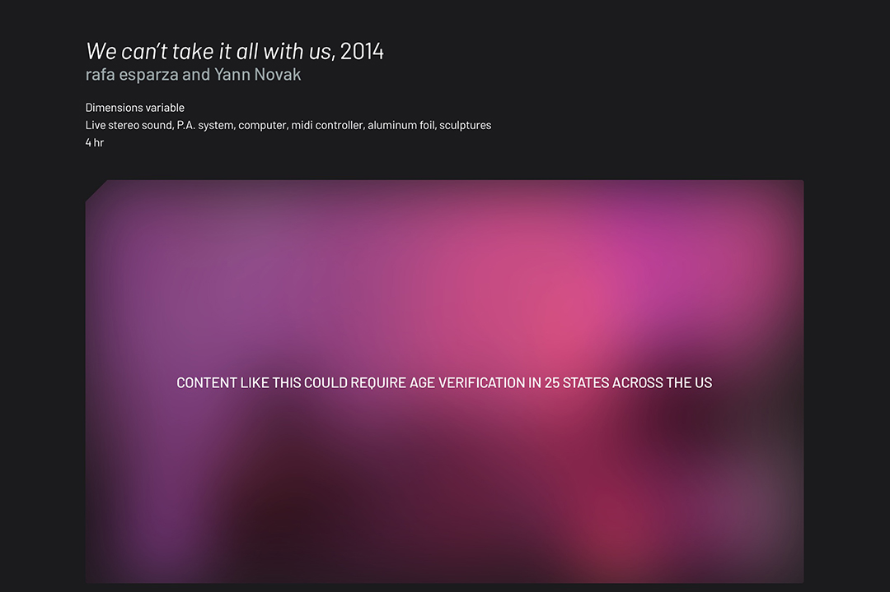

# We can’t take it all with us



*We can’t take it all with us* is an experimental website created for the Rip Space workshop “Censored Online, Thriving Offline.” It explores how age verification laws might impact individual artists sharing work that may contain borderline content.

## Features

- Age verification notice and blur effect when online
- When offline, age verification notice and blur are automatically removed

## Live Demo

You can view the artwork here:  
[https://we-cant-take-it-all-with-us.netlify.app](https://we-cant-take-it-all-with-us.netlify.app)

## Usage

- Visit the website online to see the age verification notice and blur effect.
- Disconnect from the internet (go offline) to see the age verification notice and blur removed automatically.

## Artwork Credits

- **Title:** We can’t take it all with us  
- **Artist:** rafa esparza & Yann Novak  
- **Year:** 2014  

## Website Credits

- **Title:** We can’t take it all with us  
- **Artist:** Yann Novak  
- **Year:** 2025  
- **Code:** Yann Novak
- **Typeface:** [Barlow](https://github.com/jpt/barlow) by Jeremy Tribby  
- **offline-script.js:** Inspired by and adapted from a script by Maisa Imamović  
- **Workshop:** Created during the [rip_space](https://rip.space) “Censored Online, Thriving Offline” Workshop 

## About the Project

This project was created as part of the “Censored Online, Thriving Offline” workshop hosted by [rip_space](https://rip.space).
Special thanks to Maisa Imamović for leading the workshop and for providing the original offline-script.js, which I adapted for this project.  
For other uses, please contact Yann Novak.

## Project Structure
```
we-cant-take-it-all-with-us/
├── assets/
│   ├── css/
│   │   └── main.css
│   ├── fonts/
│   │   └── barlow/
│   │       └── …
│   ├── js/
│   │   ├── links.json
│   │   ├── main.js
│   │   └── offline-script.js
│   └── src/
│       └── …
├── .gitignore
├── index.html
└── README.md
```