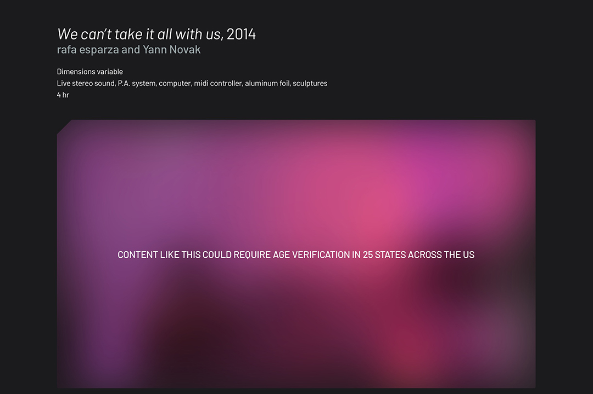

# We can’t take it all with us

*We can’t take it all with us* is an experimental website created for the Rip Space workshop “Censored Online, Thriving Offline.”

 

## ✨ Features

- Censorship notice and blur effect when online
- When offline, censorship notice and blur are automatically removed

 

## 🎬 Live Demo

You can view the artwork here:  
[https://we-cant-take-it-all-with-us.netlify.app](https://we-cant-take-it-all-with-us.netlify.app)

 

## 🕹️ Usage

- Visit the website online to see the censorship notice and blur effect.
- Disconnect from the internet (go offline) to see the censorship notice and blur removed automatically.

 

## 📄 Artwork Credits

- **Title:** We can’t take it all with us  
- **Artist:** rafa esparza & Yann Novak  
- **Year:** 2014  

 

## 📄 Website Credits

- **Title:** We can’t take it all with us  
- **Artist:** Yann Novak  
- **Year:** 2025  
- **Code:** Yann Novak
- **Typeface:** [Barlow](https://github.com/jpt/barlow) by Jeremy Tribby  
- **offline-script.js:** Inspired by and adapted from a script by Maisa Imamović  
- **Workshop:** Created during the [rip_space](https://rip.space) “Censored Online, Thriving Offline” Workshop 

 

## ℹ️ About the Project

This project was created as part of the “Censored Online, Thriving Offline” workshop series hosted by [rip_space](https://rip.space).  
Special thanks to Maisa Imamović for the inspiration behind the offline-script.js.  
For other uses, please contact Yann Novak.
